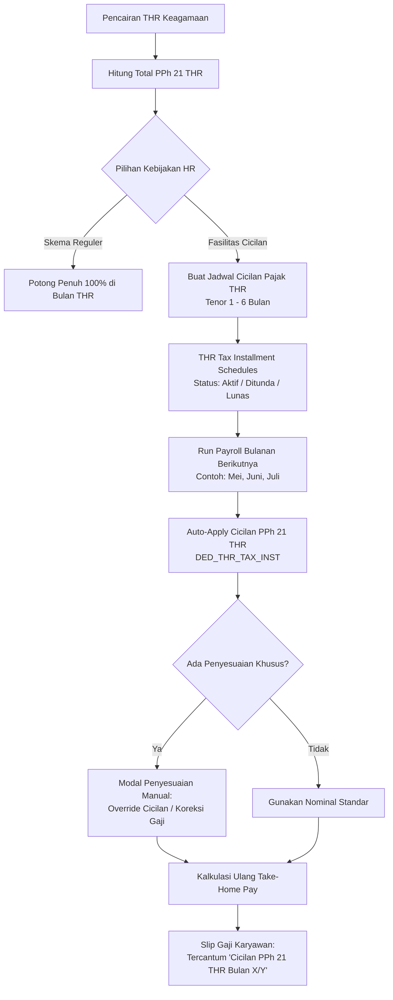

# Rangkuman Perubahan Modul Payroll: Skema Cicilan PPh 21 THR & Manual Adjustment

## 1. Latar Belakang & Analisis Kasus
Pada saat pembagian Tunjangan Hari Raya (THR) Keagamaan, penghitungan pajak PPh 21 atas THR (menggunakan skema Tarif Efektif Rata-Rata / TER Non-Reguler atau tarif Pasal 17 akumulasi) sering kali menghasilkan nilai pajak yang cukup signifikan.

Apabila pajak THR tersebut langsung dipotong penuh 100% pada periode pencairan THR, take-home pay (THP) karyawan pada bulan tersebut dapat berkurang drastis atau karyawan merasa terbebani. Sebagai kebijakan internal perusahaan:
1. Perusahaan membayarkan/menyetorkan terlebih dahulu kewajiban PPh 21 THR karyawan ke kas negara (agar tetap taat regulasi SPT Masa Pajak).
2. Potongan pajak tersebut kemudian **diberikan fasilitas cicilan bertahap** (misalnya 2, 3, atau hingga 6 bulan) sebagai pengurang gaji bulanan pada periode-periode berikutnya.
3. HR juga memerlukan **fleksibilitas manual adjustment** per karyawan untuk menangani case khusus (seperti percepatan pelunasan, karyawan resign, atau penundaan cicilan sementara).

---

## 2. Solusi yang Diimplementasikan pada Frontend (FE)

Sistem telah diimplementasikan dengan menggabungkan dua pendekatan: **Pendekatan Otomatis/Terjadwal (Opsi B)** dan **Pendekatan Manual Adjustment (Opsi A)**.

---

## 3. Rincian Perubahan per Fitur & Halaman

### A. Kebijakan THR & Manajemen Cicilan Pajak (`ThrConfigView`)
*File: [thr-config-view.tsx](file:///Users/nanang212/Documents/PRJ-PRIBADI/hris/hris-web/src/features/payroll/pages/configuration/thr-config-view.tsx)*

1. **Konfigurasi Fasilitas Cicilan Pajak PPh 21 THR**:
   - **Toggle Switch**: Mengaktifkan / menonaktifkan fasilitas cicilan pajak THR di tingkat perusahaan.
   - **Tenor Default**: Pilihan tenor angsuran (1 bulan, 2 bulan, 3 bulan, 4 bulan, hingga 6 bulan).
   - **Ambang Batas Minimum**: Menentukan batas minimal nominal pajak yang berhak dicicil (misal: minimal Rp 300.000).
   - **Otomatisasi Payroll**: Switch untuk otomatis memasukkan cicilan ke batch payroll bulanan berikutnya.
2. **Interactive Calculator & Simulation Widget**:
   - HR dapat melakukan simulasi interaktif dengan memasukkan Upah Pokok, Masa Kerja (slider 1-48 bulan), dan pilihan tenor.
   - Sistem secara instan menampilkan perkiraan nominal bruto THR, estimasi pajak PPh 21 TER, dan pembagian cicilan bulanan lengkap dengan alokasi pada slip gaji.
3. **Tabel Jadwal Cicilan Pajak Karyawan (Active Installment Schedules)**:
   - Menampilkan daftar jadwal karyawan yang sedang mengangsur pajak THR.
   - Informasi detail: Nama Karyawan, NIK, Departemen, Total THR, Total Pajak THR, Tenor & Periode, Cicilan/Bulan, Progres Angsuran (visual progress bar + badge `Bulan X dari Y`), Sisa Saldo, dan Status (`Aktif Berjalan`, `Lunas`, `Ditunda`).
   - **Aksi Cepat Interaktif**:
     - ✏️ **Edit Tenor / Nominal**: Menyesuaikan tenor atau nominal angsuran.
     - ⏸️ / ▶️ **Jeda / Lanjutkan Cicilan**: Membekukan cicilan untuk bulan tertentu tanpa menghapus jadwal.
     - ✅ **Lunasi Sekaligus**: Melunasi seluruh sisa saldo secara langsung.
4. **Modal Tambah Jadwal Manual**:
   - Form dialog untuk mendaftarkan jadwal cicilan karyawan secara manual (nama, NIK, nominal THR, total pajak, tenor, dan periode mulai).

---

### B. Penyesuaian Manual pada Detail Batch Payroll (`PayrollProcessDetail`)
*File: [payroll-process-detail.tsx](file:///Users/nanang212/Documents/PRJ-PRIBADI/hris/hris-web/src/features/payroll/pages/process/payroll-process-detail.tsx)*

1. **Kolom Baru "Cicilan PPh 21 THR" pada Tabel Karyawan**:
   - Menampilkan potongan cicilan pajak THR secara transparan per baris karyawan (misal: `-Rp 500.000` dengan subtext `Bulan 2/3`).
2. **Tombol Aksi Penyesuaian Manual**:
   - Ikon pengaturan (`IconAdjustments`) dengan tooltip *"Penyesuaian Manual & Cicilan Pajak THR"*.
3. **Modal Dialog Penyesuaian Gaji & Cicilan**:
   - **Bagian Cicilan PPh 21 THR**: HR dapat mengedit nominal potongan cicilan khusus untuk periode ini (misal: diubah, diset 0 untuk ditunda, atau ditambah).
   - **Bagian Penyesuaian Manual Tambahan**: HR dapat menambahkan potongan atau tunjangan insidental lainnya (+/-) beserta alasan memo internal.
   - **Live Impact Recalculator**: Kartu kalkulasi real-time yang memperlihatkan dampak perubahan terhadap Gaji Kotor, Total Potongan, dan Take-Home Pay baru sebelum disimpan.
   - Pembaruan status langsung memperbarui ringkasan total KPI batch (Total Gross, Total Potongan, dan Net Disbursement).

---

### C. Wizard Pembuatan Proses Payroll (`CreatePayrollWizard`)
*File: [create-payroll-wizard.tsx](file:///Users/nanang212/Documents/PRJ-PRIBADI/hris/hris-web/src/features/payroll/pages/process/create-payroll-wizard.tsx)*

- Pada **Step 3 (Attendance & Overtime Sync)**, ditambahkan opsi toggle:
  - **"Sertakan Cicilan PPh 21 THR Otomatis"** (dengan label rekomendasi).
  - Ketika aktif, saat kalkulasi payroll dijalankan, sistem otomatis menarik jadwal cicilan yang berstatus `active` untuk periode terkait.

---

### D. Master Komponen Gaji (`SalaryComponentsView` & Mock Data)
*Files:*
- *[mock-payroll-data.ts](file:///Users/nanang212/Documents/PRJ-PRIBADI/hris/hris-web/src/features/payroll/data/mock-payroll-data.ts)*
- *[types/index.ts](file:///Users/nanang212/Documents/PRJ-PRIBADI/hris/hris-web/src/features/payroll/types/index.ts)*

- Ditambahkan komponen potongan standar:
  - **Nama**: `Cicilan PPh 21 THR (Tax Installment)`
  - **Kode**: `DED_THR_TAX_INST`
  - **Kategori**: `tax`
  - **Tipe**: `deduction` (Potongan)
  - **Metode Hitung**: `fixed_amount`
- Data mock diperbarui dengan skenario nyata untuk beberapa karyawan (Rian Wijaya, Siti Aminah, Budi Santoso, Andi Pratama) yang sedang dalam progres cicilan (Bulan 2 dari 3).

---

### E. Transparansi Slip Gaji & Ekspor Dokumen (`PayslipDetailView` & PDF Helper)
*Files:*
- *[payslip-detail-view.tsx](file:///Users/nanang212/Documents/PRJ-PRIBADI/hris/hris-web/src/features/payroll/pages/payslip/payslip-detail-view.tsx)*
- *[payroll-download-helper.ts](file:///Users/nanang212/Documents/PRJ-PRIBADI/hris/hris-web/src/features/payroll/lib/payroll-download-helper.ts)*

- Pada rincian potongan slip gaji (baik tampilan layar maupun file PDF hasil cetak), baris cicilan tercantum jelas:
  - Contoh: `Cicilan PPh 21 THR (Bulan 2/3) : -Rp 500.000`
- Karyawan dapat memahami dengan jelas mengapa ada potongan pajak tambahan di luar PPh 21 reguler bulanan.

---

## 4. Panduan Alur Kerja untuk HR (Workflow)

1. **Pengaturan Kebijakan (Sekali di Awal)**:
   - Buka menu **Payroll** > Tab **Configuration** > Sub-tab **THR Policy**.
   - Aktifkan toggle *"Fasilitas Cicilan Pajak PPh 21 THR"*, tentukan tenor default (misal 3 bulan).
2. **Saat THR Diberikan (Bulan April)**:
   - Karyawan menerima THR penuh atau dengan potongan pajak yang telah disesuaikan.
   - Jadwal cicilan aktif otomatis terbentuk di tabel *Jadwal Cicilan Pajak THR Karyawan*.
3. **Saat Memproses Gaji Bulanan Berikutnya (Mei, Juni, Juli)**:
   - Buat batch payroll baru via **Process** > **Create Payroll Process**.
   - Pastikan opsi *"Sertakan Cicilan PPh 21 THR Otomatis"* tercentang pada Step 3.
   - Di halaman detail batch karyawan, kolom *Cicilan PPh 21 THR* akan otomatis terisi.
   - Jika ada karyawan yang ingin melunasi lebih cepat atau menunda, klik ikon ⚙️ (*Penyesuaian Manual*) pada baris karyawan tersebut.
4. **Penerbitan Slip Gaji**:
   - Setelah batch disetujui, slip gaji yang diterbitkan dan diunduh karyawan akan mencantumkan rincian potongan cicilan pajak THR secara transparan.

---

## 5. Rekomendasi Integrasi ke Sisi Backend (Tahap Selanjutnya)

Bila nantinya akan diintegrasikan dengan database & backend API:
1. **Tabel Database Baru**:
   - `thr_tax_installments`: Menyimpan `id`, `employee_id`, `thr_amount`, `tax_amount`, `tenor_months`, `monthly_installment`, `paid_months`, `remaining_balance`, `status`, `start_date`, `end_date`.
2. **Tabel Relasi Payroll Run Detail**:
   - Kolom `thr_tax_installment_amount` dan foreign key `thr_tax_installment_id` pada tabel `payroll_items`.
3. **Endpoint API**:
   - `GET /api/payroll/thr/installments` — Ambil daftar jadwal cicilan aktif.
   - `POST /api/payroll/thr/installments` — Buat jadwal cicilan baru (otomatis saat finalisasi THR atau manual).
   - `PATCH /api/payroll/thr/installments/:id` — Update status (pause, resume, settle full, edit tenor).
   - `POST /api/payroll/runs/:id/adjustments` — Simpan penyesuaian manual karyawan pada run tertentu.
